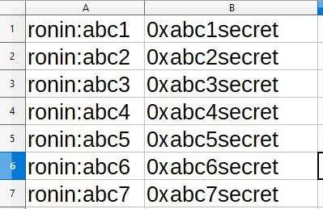

# Payments file format
It requires a JSON file like:

```
{
    "Manager": "ronin:<Manager address here>",
    "Scholars":[
        {
            "Name": "Scholar 1",
            "AccountAddress": "ronin:<account_address>",
            "ScholarPayoutAddress": "ronin:<scholar_address>",
            "ScholarPayout": 10,
            "TrainerPayoutAddress": "ronin:<trainer_address>",
            "TrainerPayout": 1,
            "ManagerPayout": 9
        },
        {...},
        ...
    ],
    "Donations": [
        {
            "Name": "Entity 1",
            "AccountAddress": "ronin:<donation_entity_address>",
            "Percent": 0.01
        },
        {
            ...
        }
    ]
}
```

Let's define the concepts in that file.
- **Manager**: There we input the "manager's" ronin address. This means all manager payments will be paid to that address.
- **Scholars**: This is the list of all scholar accounts we need to make payments to each element in this list contains:
    - **Name**: Name of this account, it is only for identification purposes.
    - **Account Address**: Public ronin address of this scholar account.
    - **Scholar Payout Address**: Scholar's ronin address. This is where we will pay the scholar.
    - **Scholar Payout**: This is the amount of SLP we will pay to the scholar
    - **Trainer Payout Address**: This is an optional parameter. It is the public ronin address of the trainer (otherwise known as investor) for this particular scholar account.
    - **Trainer Payout**: If previous parameter is present, this is the amount of SLP it will be paid to that address.
    - **Manager Payout**: This is the amount of SLP that will be transferred to the manager account.
- **Donations**: Optional list of donations, in case you want to support other projects sharing with them part of your earnings. This percent will be calculated from the Manager Payout and rounded. **Donations to me do NOT go in this place, they are in the code itself!** If any donations or the fee does not reach a minumum of 1 SLP it will not be paid out.
    - **Name**: Name of the entity you want to donate to. This is only for identification purposes.
    - **Account Address**: Public ronin address of the entity or project you want to donate to.
    - **Percent**: Percent you want to donate to that entity. **Caution!** Be aware that to donate 1% you need to input: 0.01. If you write a 1, you would be donating 100% of your manager payments! Total percent of all donations added cannot be over 1 (100%). If that is the case, the software will throw an error and ask you to correct it.


**WARNING!** All addresses in the previous file are the PUBLIC ones. Remember to always keep your private ones safe.

# Secrets file format
This JSON file is much simpler, and you should never need to create it as you can use the secret generation command. But if you are curious, the format will be like:

```
{
    <AccountAddressRonin>:<PrivateKey>,
    ...
}
```

# Transfers file format
This JSON file defines the Axie transfers you wish to do. You define from which accounts you transfer which Axies to witch accounts. Here is an example:


```
    [
    {
        "AccountAddress": "ronin:<whohasanaxie>",
        "Transfers": [
            {
                "AxieId": "<axie_id_to_transfer>",
                "ReceiverAddress": "<ronin:<whowillgetanaxie>"
            },
            {
                "AxieId": "<axie_id_to_transfer>",
                "ReceiverAddress": "<ronin:<whowillgetanaxie>"
            },
            {
                "AxieId": "<axie_id_to_transfer>",
                "ReceiverAddress": "<ronin:<whowillgetanaxie>"
            },
            {
                "AxieId": "<axie_id_to_transfer>",
                "ReceiverAddress": "<ronin:<whowillgetanaxie>"
            }
            ...
        ]
    },
    {
        "AccountAddress": "ronin:<whohasanaxie>",
        "Transfers": [
            {
                "AxieId": "<axie_id_to_transfer>",
                "ReceiverAddress": "<ronin:<whowillgetanaxie>"
            },
            {
                "AxieId": "<axie_id_to_transfer>",
                "ReceiverAddress": "<ronin:<whowillgetanaxie>"
            },
            {
                "AxieId": "<axie_id_to_transfer>",
                "ReceiverAddress": "<ronin:<whowillgetanaxie>"
            }
        ]
    },
    ...
    {
        "AccountAddress": "ronin:<whohasanaxie>",
        "Transfers": [
            {
                "AxieId": "<axie_id_to_transfer>",
                "ReceiverAddress": "<ronin:<whowillgetanaxie>"
            },
            {
                "AxieId": "<axie_id_to_transfer>",
                "ReceiverAddress": "<ronin:<whowillgetanaxie>"
            },
            {
                "AxieId": "<axie_id_to_transfer>",
                "ReceiverAddress": "<ronin:<whowillgetanaxie>"
            }
        ]
    }
]

```

As you can see we put the account where we have the axies in `AccountAddress` and then inside `Transfers` we define the transfers we want to do from that account. In each we indicate the `AxieID` and the ronin `ReceiverAddress` to receive that Axie.

# Mass update CSV file
This CSV file is quite straight forward. You can use excel or google docs or anything that produces a csv file. To get these results, you will need to add your public ronin on the 1st column and your private key for that account on the 2nd column. The resulting format will be something that looks like:

```
ronin:abc1,0xsecretabc1
ronin:abc2,0xsecretabc2
ronin:abc3,0xsecretabc3
ronin:abc4,0xsecretabc4
```
In excel or google docs it looks something like:




All these will be merged with the pre-existing ones (if any) in secrets.json

If any other columns are present, they will simply be ignored. Furthermore, if headers are at the top of the columns, please remove them on the exported csv.

# Create Payments CSV file
This CSV file is used to create the percent payments file. You can use excel or google docs or anything that procudes a csv file. It has to look like something:


And the resulting csv:

```
Name,AccountAddress,ScholarPayoutAddress,ScholarPercent,ScholarPayout,TrainerPayoutAddress,TrainerPercent,TrainerPayout 
Test1,ronin:abc1,ronin:abc_scholar1,50,
Test2,ronin:abc2,ronin:abc_scholar2,50,
Test3,ronin:abc3,ronin:abc_scholar3,50,
Test4,ronin:abc4,ronin:abc_scholar4,50,
Test5,ronin:abc5,ronin:abc_scholar5,50,100
Test6,ronin:abc6,ronin:abc_scholar6,50,100,ronin:abc_trainer6,5
Test7,ronin:abc7,ronin:abc_scholar7,50,100,ronin:abc_trainer7,0,230
```

Please, this file cannot have any other headers other than the following.

- **Name**: This is only the name, is a for identification purposes
- **AccountAddress**: Account that is played and we will claim and payout from
- **ScholarPayoutAddress**: Account of the scholar to be paid to
- **ScholarPercent**: Percentaje to pay that scholar. Minimum of 40%
- **ScholarPayout**: (Optional) If present, will make sure that scholar gets additional SLP on top of the ScholarPercent
- **TrainerPayoutAddress**: (Optional) Account of the trainer to be paid to
- **TrainerPercent**: (Optional) Persentaje to pay to a trainer (it can be 0)
- **TrainerPayout**: (Optional) If present, will make sure that trainer gets additional SLP on top of the TrainerPercent.

**Note**: Percents in this file are written as whole numbers. For example, 40 means 40%, 5 means 5%.

# Example Files

If after that you still unclear on how they look like. Please go to the folder sample_data to see sample files for how the payments file and the secrets file need to look like.
